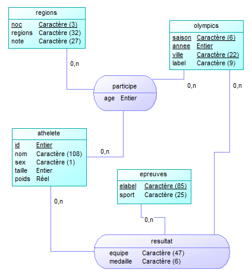
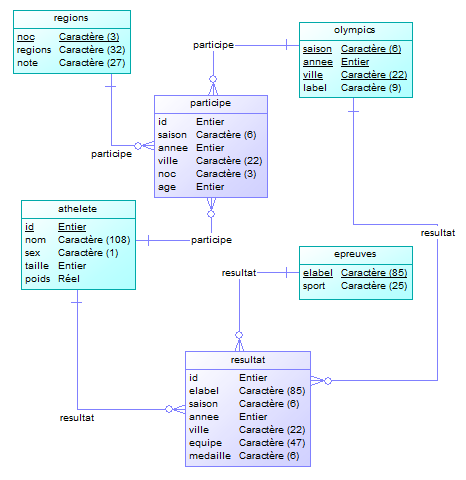

# Introduction 

Voici notre rapport concernant la partie base de donnée de la SAE 2.04.

# Exploitation des données

## Compréhension

### Combien y-a-t-til de lignes dans chaque fichier ?

``` bash
wc -l file
```

**athlete_events.csv** : 271 117 lignes.  
**noc_regions** : 230 lignes.  

### Afficher uniquement la première ligne du fichier athlète

``` bash
head -1 athlete_events.csv
```

"ID","Name","Sex","Age","Height","Weight",
"Team","NOC","Games","Year","Season","City",
"Sport","Event","Medal"

### Quel est le séparateur de champs ?

Le séparateur de champs est la virgule.

### Que représente une ligne ?

Une ligne représente une participation d'un athlète à une compétition.

### Combien y-a-t-il de colonnes ?

``` bash
head -1 athlete_events.csv |tr " " _ |tr , " " |wc -w
```

Il y a 15 colonnes.

### Quelle colonne distingue les jeux d'été et d'hivers ? 

La colonne **Season**.

### Combien de lignes font référence à Jean-Claude Killy ?

``` bash
cat athlete_events.csv |grep "Jean-Claude Killy" |wc -l
```

Il y a 6 lignes qui font références à Jean-Claude Killy.

### Quel encodage est utilisé pour ce fichier ?

``` bash
file -b -i  athlete_events.csv
```

Ce fichier est encodé en **us-ascii**.

### Comment envisagez-vous l'import de ces données ?

- Convertir de fichier en utf-8  
``` bash
iconv -f us-ascii  -t utf-8 athlete_events.csv > athlete_events_utf8.csv
```

- Importer les données  

**athlete_events_utf8.csv**  
``` SQL
\copy import from 'athlete_events_utf8.csv' with (FORMAT csv, NULL 'NA', HEADER, ENCODING 'UTF-8')
```

**noc_regions_utf8.csv**
``` SQL
\copy noc from 'Ressource/noc_regions_utf8.csv' with (FORMAT csv, NULL '', HEADER, ENCODING 'UTF-8')
```

La table temporaire import possèdes les colonnes suivantes :  
``` SQL
id INT, nom TEXT, genre TEXT, age INT, taille INT, poids INT, genre TEXT,
age INT, taille INT, poids FLOAT, equipe TEXT, noc TEXT, label TEXT, 
annee INT, saison TEXT, ville TEXT, sport TEXT, elabel TEXT, medaille TEXT;
```

La table temporaire noc possèdes les colonnVARCHAR(32) : SELECT MAX(LENGTH(regions)) FROM import;es suivantes :  
``` SQL	
noc TEXT, regions = TEXT, notes = TEXT;
``` 

## Importer les données

Voici le code SQL qui permet d'importer les données des .csv directement dans les tables temporaire, il est trouvable dans le script "importation.sql". Ce script est idempotent, il produit toujours le même résultat.  

``` SQL
-- Suppression des tables si elles existent déjà
DROP TABLE IF EXISTS import CASCADE;
DROP TABLE IF EXISTS noc;
DROP TABLE IF EXISTS athlete CASCADE;
DROP TABLE IF EXISTS regions CASCADE;
DROP TABLE IF EXISTS olympics CASCADE;
DROP TABLE IF EXISTS epreuves CASCADE;
DROP TABLE IF EXISTS participe;
DROP TABLE IF EXISTS resultat;

-- Création de la table import
CREATE temp TABLE import (
    id INT, nom TEXT, genre TEXT, age INT, taille INT, poids FLOAT,
    equipe TEXT, noc TEXT, label TEXT, annee INT, saison TEXT, 
    ville TEXT, sport TEXT, elabel TEXT, medaille TEXT);

-- Importation des données dans la table import
\copy import from 'Ressource/athlete_events_utf8.csv' with (FORMAT csv, NULL 'NA', HEADER, ENCODING 'UTF-8')

-- Suppression des lignes qui ne nous intéressent pas
DELETE FROM import WHERE n10 < 1920 OR n13 = 'Art Competitions';

-- Création de la table noc
CREATE temp TABLE noc (
    noc TEXT, regions TEXT, notes TEXT);

-- Importation des données dans la table noc
\copy noc from 'Ressource/noc_regions_utf8.csv' with (FORMAT csv, NULL '', HEADER, ENCODING 'UTF-8')
```

## Exercice 4 : Ventilation des données

### Modèles Conceptuel de Donnée

Nous avons décidé de séparer les jeu de données en 4 entités :
- **athlete** qui contient la liste de tous les athlètes ayant participé aux Jeux Olympiques.
- **regions** qui contient la liste des différents pays et régions ayant participé.
- **olympics** qui contient la liste des différentes éditions des JO.
- **epreuves** qui contient la liste de toutes les épreuves ayant eu lieu.

Et nous les avons reliées par les relations suivantes :
- **participe**
- **resultat**



Pour définir les valeurs à mettre dans les VARCHAR, nous avons utilisé les requêtes suivantes :  
``` SQL 
SELECT MAX(LENGTH(nom)) FROM import;
SELECT MAX(LENGTH(genre)) FROM import;
SELECT MAX(LENGTH(equipe)) FROM import;
SELECT MAX(LENGTH(noc)) FROM import;
SELECT MAX(LENGTH(label)) FROM import;
SELECT MAX(LENGTH(saison)) FROM import;   
SELECT MAX(LENGTH(ville)) FROM import;
SELECT MAX(LENGTH(sport)) FROM import;
SELECT MAX(LENGTH(elabel)) FROM import;
SELECT MAX(LENGTH(medaille)) FROM import;

SELECT MAX(LENGTH(noc)) FROM noc;
SELECT MAX(LENGTH(regions)) FROM noc;
SELECT MAX(LENGTH(notes)) FROM noc;
```

### Modèles Logiques de Donnée

Notre modèle logique de données est donc composé de 6 tables : 
- **athlete**(<u>id</u>, nom, sex, taille, poids)
- **regions**(<u>noc</u>, regions, notes)
- **olympics**(<u>saison</u>, <u>annee</u>, <u>ville</u>, label)
- **epreuves**(<u>elabel</u>, sport)
- **participe**(#id, #saison, #annee, #ville, #noc, age)
- **resultat**(#id, #elabel, #saison, #annee, #ville, equipe, medaille)



## Exercice 6 : Requêtes personnalisées

Pays choisi : Chine
Sport choisi : Tennis de table

### Liste des joueur Chinois de Tennis de Table ayant eu le plus grands nombres de médailles d'or

``` SQL
SELECT o.annee, COUNT(*) AS nELECT a.nom, COUNT(*) AS nbMedaillesOr
FROM resultat AS r, athlete AS a
WHERE r.id = a.id 
AND r.equipe = 'China' 
AND r.medaille = 'Gold' 
AND r.elabel LIKE 'Table Tennis%'
GROUP BY a.nom
HAVING COUNT(*) = (SELECT COUNT(a.nom) AS nbMedaillesOr
                    FROM resultat AS r, athlete AS a
                    WHERE r.id = a.id 
                    AND r.equipe = 'China' 
                    AND r.medaille = 'Gold' 
                    AND r.elabel LIKE 'Table Tennis%'
                    GROUP BY a.nom
                    ORDER BY nbMedaillesOr DESC 
                    LIMIT 1);
```

### Nombre de joueur Chinois ayant participé aux Jeux Olympiques

``` SQL
SELECT COUNT(DISTINCT r.id)
FROM resultat AS r
WHERE r.equipe = 'China'
AND r.label LIKE 'Table Tennis%';
```

### Taille, poids et âge moyen des joueurs Chinois de Tennis de Table masculin

``` SQL
SELECT ROUND(AVG(a.taille)::numeric, 2) AS tailleMoyenne, ROUND(AVG(a.poids)::numeric, 2) AS poidsMoyen, ROUND(AVG(p.age)::numeric, 2) AS ageMoyen
FROM athlete AS a, resultat AS r, participe AS p
WHERE a.id = r.id AND a.id = p.id
AND r.equipe = 'China'
AND r.label LIKE 'Table Tennis%'
AND a.genre = 'M';
```

### Nom de tout les joueurs Chinois ayant remporté au moins une médaille

``` SQL
SELECT DISTINCT a.nom
FROM resultat AS r, athlete AS a
WHERE r.id = a.id
AND r.equipe = 'China'
AND r.label LIKE 'Table Tennis%'
AND r.medaille IS NULL;
```